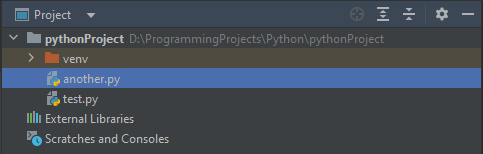
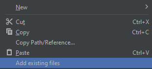
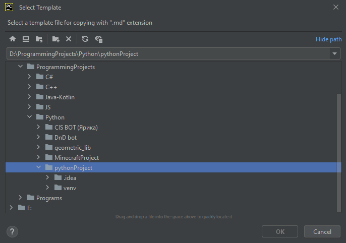
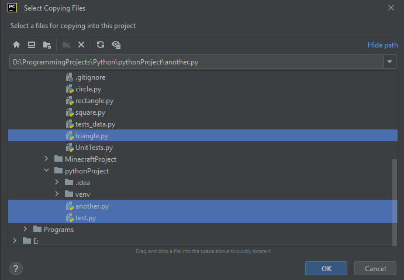
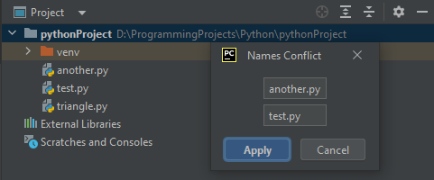

# Intellij IDEA plugin. Laboratory work №3.
> [!IMPORTANT]
> This work was made by Postnikov Andrey (ISU id: 409391) from group M3101

This plugin was created to simplify simultaneous copying of multiple files from one project to another.
Plugin supports copying with rules from custom template, which you can create also using this plugin.

## Usage

Let's look at the work of the plugin using the example of a python project with several files.



If we use right mouse button on any file, we will see another item in the end Copy/Paste block: "Add existing files".



When we press this button, dialog window for choosing template of copying appears.



If you want to copy with specific rules you can use [***templates***](TEMPLATE.md). But for simple copying you can press "Cancel" button.

After this appears another dialog window. It is needed for choosing copied files.



We choose files, but some of them have same names as we already have in project. Plugin copy all files, which have no naming conflicts and show dialog window to resolve these conflicts.



When edited name is free, plugin add file with such name to project.

## Commit history
```
commit 0d5efcad5022775d98dcb70f91c7c72b0456434e (HEAD -> main, origin/main, orig
in/HEAD)
Author: AnPosy <63587513+PressStart9@users.noreply.github.com>
Date:   Sat Nov 4 13:17:17 2023 +0300

    feat: add documentation

commit fdd5e35191970161d3174d57cacea3c9b0b18742
Author: AnPosy <63587513+PressStart9@users.noreply.github.com>
Date:   Fri Nov 3 18:33:47 2023 +0300

    feat: add template support for copying

commit 5d2c58c70d10b0e5acfb42dc7666e010f41b9b76
Author: AnPosy <63587513+PressStart9@users.noreply.github.com>
Date:   Sun Oct 22 21:20:19 2023 +0300

    feat: add naming conflict window

commit 38d8a7174cd0eec39a6069297527e39e1c78044c
Author: AnPosy <63587513+PressStart9@users.noreply.github.com>
Date:   Sun Oct 22 14:40:53 2023 +0300

    feat: add button, which copies file into current project

commit 3d86e03d7c976dc2799fda791faa62d78dea400a
Author: GitHub Action <action@github.com>
Date:   Mon Oct 16 17:56:11 2023 +0000

    Template cleanup

commit f11a4a4f48f8adb1d587dde972931cabe41de6cc
Author: AnPosy <63587513+PressStart9@users.noreply.github.com>
Date:   Mon Oct 16 20:55:56 2023 +0300

    Initial commit
```