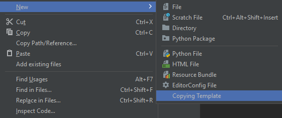
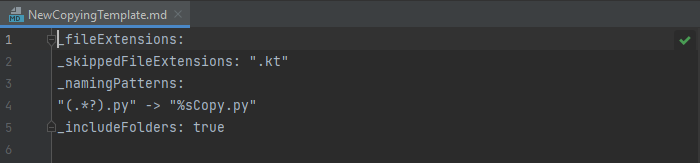

# Templates

To specify some copying rules we can use templates with ".md" extension.
> [!IMPORTANT]
> Choosing incorrect file as template is ***UNDEFINED BEHAVIOUR***.
> 
> All extra spaces or another symbols can cause errors.

## Creating

In the end of popup window for creating new files there is new button, which creates copying template.

This creates file of ".md" extension with the following content:

## Format

1. First row have to start with property name "_fileExtensions", after it follows ": "
   1. If next line content is empty, all files extension will be included.
   2. If you want to copy files with specific extensions, you have to write them next to each other in double quotes with ", " as separator.
2. Second row have to start with property name "", after it follows ": "
   1. If next line content is empty, all files extension will be included.
   2. If you want not to copy files with specific extensions, you have to write them next to each other in double quotes with ", " as separator.
3. Third row have to start with property name "_namingPatterns", after it follows ":"
   1. If next line is next property, there is no naming patters.
   2. Each next line before next property have to start with regex expression in double quotes. After it follows " -> " and at the end have to be Kotlin string literal.
   3. By regex expression you can specify file extensions or get a group from name, which will be inserted in "%s" place of your Kotlin string
4. Last row have to start with property name "_includeFolders", after it follows ": " and "true" or "false word"
